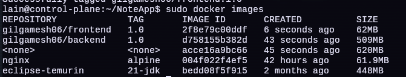
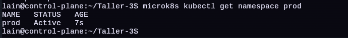
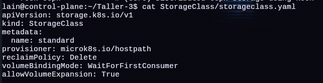
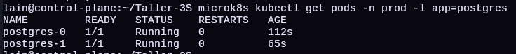
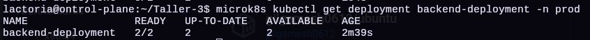
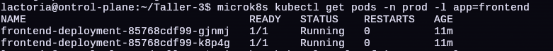
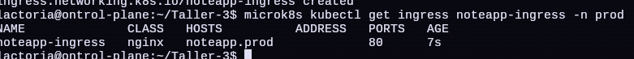
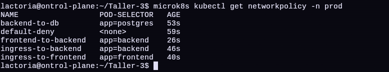

# Taller4: MicroK8s  + MetalLB + Calico + Ingress controller NGINX

* **Objetivos**

    * Un **cluster MicroK8s multi-nodo**
    * Networking con **Calico**
    * **Ingress Controller NGINX**
    * **MetalLB** simulando un LoadBalancer real
    * Buenas prácticas cercanas a producción


* **Que trae Microk8s y que No ?**

    * Antes de tocar comandos, aclaremos esto: (**importante**)

    * **Add-ons que MicroK8s ya trae**

        | Componente         | ¿Está en MicroK8s?| ¿Cómo se activa?                |
        | ------------------ | ----------------- | ------------------------------- |
        | Calico (CNI)       |  Sí (por defecto) | Automático                       |
        | CoreDNS            |  Sí               | `microk8s enable dns`            |
        | NGINX Ingress      |  Sí               | `microk8s enable ingress`        |
        | MetalLB            |  Sí               | `microk8s enable metallb`        |
        | Metrics Server     |  Sí               | `microk8s enable metrics-server` |
        | Storage (hostpath) |  Sí               | `microk8s enable storage`        |
        | Dashboard          |  Sí (opcional)    | `microk8s enable dashboard`      |

* **Cosas que No trae (Pero producción suele tener)**

* No se van a instalar en este taller, pero se mencionan:

    * Cert-Manager (TLS automatico)
    * Prometheus / Grafana
    * External Secrets
    * ArgoCD / Flux
    * oIDC / IAM


    ## Diseño del cluster

    * **Topologia**

        ```bash
        Nodo 1 -> control-plane
        Nodo 2 -> worker
        ```
        > En MicroK8s **todos los nodos pueden ser control-plane**, pero esto es suficiente para el taller.

    ## Componenetes finales del cluster

    ```bash
    MicroK8s Cluster
    ├── API Server
    ├── etcd
    ├── Scheduler
    ├── Controller Manager
    ├── containerd
    ├── Calico (CNI)
    ├── CoreDNS
    ├── NGINX Ingress Controller
    └── MetalLB (LoadBalancer)
    ``` 
    ## Parte 1: Creacion Maquinas virtuales

    * En este taller usaremos VMs para simular Servidores: (`control-plane` y `worker`)

    1. **Instalación de KVM y QEMU**

        ```bash
        sudo apt update
        sudo apt install qemu-kvm libvirt-daemon-system libvirt-clients bridge-utils virt-manager
        ```
    
    2. **Reboot**

        ```bash
        reboot
        ```
    3. **Descargar imagen Ubuntu Server**

        * hostaname:

            1. control-plane (VM 1)
            2. worker (VM 2)

    4. **Instalar OpenSSH en cada VM**

        ```bashs
        sudo apt update
        sudo apt install -y openssh-server
        sudo systemctl enable --now ssh
        ```

        * Verificar 

            ```bash
            sudo systemctl status ssh
            ```

    ## Parte 2: Insalación de MicroK8s

    1. **Requerimientos minimos***

        * Ubuntu 20.03+ (recomendado)
        * 2 GB RAM (4 GB ideal)
        * Snap instalado

    2. **Instalación**

        * Ejecutamos en los dos VMs 
            
            ```bash
            sudo snap install microk8s --classic --channel=latest/stable 
            ```
            * Verificamos

                ```bash
                microk8s status --wait-ready
                ```

    3. **Permisos**

        * Ejecutamos en las dos VMs
            
            ```bash
            sudo usermod -a -G microk8s $USER
            newgrp microk8s
            ```

    ## Parte 3: Creación del Cluster Multi-nodo

    1. **Nodo principal (Control-plane)**

        * En el nodo principal:

            ```bash
            microk8s add-node
            ```
        * Salida ejemplo:

            ```bash
            microk8s join 192.168.1.10:25000/abcdef...
            ```
    2. **Unir nodos worker**

        * En cada nodo worker

            ```bash
            microk8s join <IP>:25000/<TOKEN>
            ```
    3. **Verificar nodos**

        ```bash
        microk8s kubectl get nodes
        ```
        * Resultado esperado:

            ```bash
            NAME     STATUS   ROLES
            node-1   Ready    control-plane
            node-2   Ready    <none>
            ```

    4. **Labels**

        * En el control plane ejecutamos los siguientes comando para asignar labels: `control-plane` y `worker`

            ```bash
            microk8s kubectl label node worker node-role.kubernetes.io/worker=worker
            microk8s kubectl label node control-plane node-role.kubernetes.io/control-plane=control-plane
            ```

    ## Parte 4: Storage

    * **Esta hostpath-storage**

        * Aveces lo habilita por defecto para confirmar 

            ```bash
            microk8s enable hostpath-storage
            ```        

    ## Parte 5: Networking: Calico (CNI)

    * **Esta Calico instalado ?**

        * Si, por defecto en MicroK8s

        * Verifica:

            ```bash
            microk8s kubectl get pods -n kube-system | grep calico
            ```
        * Deberias ver:

            * calico-node
            * calico-kube-controllers

    * **Porque Calico es *production-like***

        * Soporta **NetworkPolicies**
        * Control de tráfico L3/L4
        * Aislamiento real entre Pods
        * Muy usado en producción real

        * **No hay que instalar nada adicional aqui**

    ## Parte 6: DNS del cluster

    ```bash
    microk8s enable dns
    ```

    * Verificación

        ```bash
        microk8s kubectl get pods -n kube-system | grep dns
        ```

    ## Parte 7: MetalLB (LoadBalancer realista)

    1. **Activar MetalLB**

        ```bash
        microk8s enable metallb
        ```
        * Te pedira un rango de IPs:

        * Ejemplo:

            ```bash
            192.168.1.200-192.168.1.210
            ```
        * Deben ser IPs:

            * Libres 
            * En la misma red que los nodos

    2. **Que hace MetalLB ?**

        * Asigna IPs externas a servicios `type: LoadBalancer`
        * Simula AWS ELB / GCP LB / Azure LB
        * Permite Ingress REAL

    3. **Verificar MetalLB**

        ```bash
        microk8s kubectl get pods -n metallb-system
        ```
    ## Parte 8: Ingress Controller NGINX

    * No se usa el add-ons:

        * Porque no permite usar MetalLB utiliza port del nodo, no funciona con LoadBalancer

    1. **Instalación**

        ```bash
        microk8s kubectl apply -f https://raw.githubusercontent.com/kubernetes/ingress-nginx/controller-v1.11.2/deploy/static/provider/kind/deploy.yaml
        ```
        * Que instala:

            * Namespace: `ingress-nginx`
            * Deployment del controller
            * Service type LoadBalancer
            * RBAC
            * IngressClass `nginx`
        
        * `ingress-nginx-controller` se crea con:

            ```yaml
            type: Nodeport
            ```
            * Al ser Nodeport Queda en `<pending>` porque no asignamos `NodeIP:portNode`
            * Debemos modificarlo y cambiarlo: `Nodeport -> LoadBalancer`

                ```bash
                microk8s kubectl edit svc ingress-nginx-controller -n ingress-nginx
                ```
            * **Resultado**

        * **Problema de etiquetas**

            * `kubernetes.io/os=linux`
            * `ingress-ready=true`
            * Ingresar

                ```bash
                microk8s kubectl edit deployment ingress-nginx-controller -n ingress-nginx
                ```
            * Eliminar las siguientes lineas:

                ```yaml
                nodeSelector:
                    ingress-ready: "true"
                    kubernetes.io/os: linux
                ```
    2. **Verificar Pods**
            
        ```bash
        microk8s kubectl get pods -n ingress-nginx
        ```
        * **¿Qué es?:** Un comando para ver los Pods del Ingress Controller.
        * **¿Para qué sirve?:** Confirmar que el controlador de NGINX se ha desplegado y está listo para recibir tráfico
        * **¿Cómo funciona?:** Lista los Pods dentro del namespace dedicado al controlador de Ingress.
        * **Resultado**


    ## Parte 9: Validacion final del cluster

    1. **Ver add-ons activos**

        ```bash
        microk8s status
        ```
        * Debe mostrar

            * dns: enabled
            * ingress: enabled
            * metallb: enabled
    
    2. **Comprobación rápida**

        ```bash
        microk8s kubectl get svc -A
        ```
        * Busca servicios `LoadBalancer`

    ## Imagenes en Docker Hub (No ejecutar esto es solo explicativo)

    * Para poder realizar la practica subi imagenes de la aplicacion NoteApp a Docker Hub

        * Razon: 
        
            * A diferencia de Kind no es facil pasarlas de Docker a Microk8s uso de Registry
            * Registry no es automatico toca modificar cada nodo para llamarlo
            * Configuraciones para automatizarlo genera que el cluster se rompa

        ### Parte 1: Instalar Docker

        1. **Instalación**

            ```bash
            sudo apt update
            sudo apt install docker.io
            ```
            * Instalamos docker para poder crear imagenes

        ### Parte 2: Clonar Repo NoteApp

        1. **Clonar repo: Build Images**

            ```bash
            git clone https://github.com/Gilgamesh06/NoteApp.git
            cd NodeApp
            ```

        2. **Cambiar a rama deploy**

            ```bash
            git checkout deploy
            ```
        3. **Generar imagen del backend**

            ```bash
            sudo docker build -t gilgamesh06/backend:1.0 -f Container/Backend/Dockerfile .
            ```
        
        4. **Genrar imagne del frontend**

            ```bash
            sudo docker build -t gilgamesh06/frontend:1.0 -f Container/Frontend/Dockerfile .
            ```
        5. **Verificar Images**

            ```bash
            sudo docker images
            ```

            * **Resultado**

                
        
        ### Parte 3: Subir imagen docker hub

        1. **Iniciar Sesión en Docker Hub**

            ```bash
            docker login
            ```
            * Te pedira tu nombre de usuario y contraseña
        
        2. **Subir la imagen a Docker Hub**

            ```bash
            docker push gilgamesh06/backend:1.0
            docker push gilgamesh06/frontend:1.0
            ```
        

    ## Parte 10: Clonar Repo Manifest

    1. **Clonar repo: Manifests**

        ```bash
        git clone https://github.com/Gilgamesh06/Taller-3.git
        ```
    
    ## Parte 11: Namespace

    1. Creamos un Namespace para: Aislar recursos (Pods, Services, RBAC, NetworkPolicy)

        ```yaml
        apiVersion: v1
        kind: Namespace
        metadata:
            name: prod
        ```
        * **¿Qué es?:** Un recurso de tipo Namespace en Kubernetes.
        * **¿Para qué sirve?:** Proporciona un mecanismo para aislar grupos de recursos dentro de un solo clúster.
        * **¿Cómo funciona?:** Crea un entorno lógico llamado prod donde se desplegarán todos los componentes de la aplicación, evitando conflictos con otros recursos del clúster.

    2. Aplicamos el manfiesto

        ```bash
        microk8s kubectl apply -f namespace.yaml
        ```
    3. Confirmamos que se creo el namespace

        ```bash
        microk8s kubectl get namespace prod
        ```
        * **¿Qué es?:** Un comando para obtener información sobre un namespace específico.
        * **¿Para qué sirve?:** Validar que el objeto `Namespace` llamado `prod` exista y está activo.
        * **¿Cómo funciona?:** Solicita al API de Kubernetes los detalles del recurso `Namespace/prod`

        * **Resultado**

            

    ## Parte 12: Modificacion `storageclass.yaml`

    * Taller 3 Se creo en kind no en microk8s por eso tenemos que realizar el siguiente cambio

        1. **Modificar: `storageclass.yaml`**

            ```yaml
            provisioner: rancher.io/local-path
            ```
            * Se debe cambiar a `provisioner: microk8s.io/hostpath`

            * **Resultado**

                

    ## Parte 13: Data Base

    * **StorageClass: `storageclass.yaml`**

        ```yaml
        apiVersion: storage.k8s.io/v1
        kind: StorageClass
        metadata:
            name: standard
        provisioner: microk8s.io/hostpath
        reclaimPolicy: Delete
        volumeBindingMode: WaitForFirstConsumer
        allowVolumeExpansion: True
        ```
        * **¿Qué es?**: Una definición de `StorageClass` en Kubernetes.
        * **¿Para qué sirve?**: Permite a los administradores describir los "perfiles" de almacenamiento ofrecidos.
        * **¿Cómo funciona?**: Utiliza el provisionador `local-path` de Rancher para crear volúmenes dinámicamente en el disco del host. El modo `WaitForFirstConsumer` asegura que el volumen se cree solo cuando un Pod que lo necesite sea programado en un nodo.
    
    * **Secret: `db-secret.yaml`**

        ```yaml
        apiVersion: v1
        kind: Secret
        metadata:
            name: db-secret
            namespace: prod
        type: Opaque
        stringData:
            POSTGRES_USER: "Solus"
            POSTGRES_PASSWORD: "123456"
        ```
        * **¿Qué es?**: Un objeto de tipo `Secret` en Kubernetes.
        * **¿Para qué sirve?**: Almacena de forma segura información sensible, como contraseñas y nombres de usuario de la base de datos.
        * **¿Cómo funciona?**: Permite inyectar estos datos en los contenedores como variables de entorno sin exponerlos directamente en el código o en los manifiestos de despliegue.
    
    * **ConfigMap: `db-confimap.yaml`**

        ```yaml
        apiVersion: v1
        kind: ConfigMap
        metadata:
            name: db-config
            namespace: prod
        data:
            POSTGRES_DB: note_app
        ```
        * **¿Qué es?**: Un objeto de tipo `ConfigMap` en Kubernetes.
        * **¿Para qué sirve?**: Almacena datos de configuración no confidenciales en pares clave-valor.
        * **¿Cómo funciona?**: Proporciona el nombre de la base de datos (`note_app`) al contenedor de PostgreSQL, desacoplando la configuración del artefacto de la imagen.

    * **Service de Base de Datos: `postgres-svc.yaml`**
        ```yaml
        apiVersion: v1
        kind: Service
        metadata:
          name: postgres
          namespace: prod
        spec:
          clusterIP: None
          selector:
            app: postgres
          ports:
          - port: 5432
            targetPort: 5432
        ```
        * **¿Qué es?**: Un Service de tipo "Headless" (sin IP de clúster).
        * **¿Para qué sirve?**: Permite el descubrimiento de los Pods individuales del StatefulSet a través de DNS interno.
        * **¿Cómo funciona?**: Al establecer `clusterIP: None`, Kubernetes no asigna una sola IP para balanceo, sino que devuelve las IPs de todos los Pods asociados, permitiendo comunicación directa con las instancias de la base de datos.

    * **StatefulSet: `db.yaml`**

        ```yaml
        apiVersion: apps/v1
        kind: StatefulSet
        metadata:
          name: postgres
          namespace: prod
        spec:
          serviceName: postgres
          replicas: 2
          selector:
            matchLabels:
                app: postgres
          template:
                metadata:
                    labels:
                        app: postgres
                spec:
                    containers:
                    - name: postgres
                      image: postgres:16
                      envFrom:
                      - configMapRef:
                            name: db-config
                      - secretRef:
                            name: db-secret
                        ports:
                        - containerPort: 5432
                        volumeMounts:
                        - name: data
                          mountPath: /var/lib/postgresql/data
        volumeClaimTemplates:
        - metadata:
            name: data
          spec:
            accessModes: ["ReadWriteOnce"]
            resources:
                requests:
                    storage: 1Gi
            storageClassName: standard
        ```
        * **¿Qué es?**: Un controlador de tipo `StatefulSet`.
        * **¿Para qué sirve?**: Gestiona el despliegue de aplicaciones con estado que requieren identificadores únicos y almacenamiento persistente estable.
        * **¿Cómo funciona?**: Crea réplicas ordenadas de PostgreSQL. Cada réplica tiene su propio volumen persistente basado en la plantilla `volumeClaimTemplates`, garantizando que si un Pod se reinicia, mantendrá sus datos.

    * **Aplicar**

        ```bash
        microk8s kubectl apply -f storageclass.yaml
        microk8s kubectl apply -f db-secret.yaml
        microk8s kubectl apply -f db-confimap.yaml
        microk8s kubectl apply -f postgres-svc.yaml 
        microk8s kubectl apply -f db.yaml
        ```

    * **Confirmar Base de Datos**
        ```bash
        microk8s kubectl get pods -n prod -l app=postgres
        ```
        * **¿Qué es?**: Un comando para obtener Pods filtrando por etiquetas (labels).
        * **¿Para qué sirve?**: Verificar que ambos Pods del StatefulSet de PostgreSQL están en ejecución dentro del namespace `prod`.
        * **¿Cómo funciona?**: Utiliza el selector `-l app=postgres` para encontrar los objetos que coinciden con la etiqueta definida en el manifiesto.

        * **Resultado**

            

    ## Parte 14: Backend

    * **Secret: `backend-secret.yaml`**

        ```yaml
        apiVersion: v1
        kind: Secret
        metadata:
            name: backend-secret
            namespace: prod
        stringData:
            SPRING_DATASOURCE_URL: jdbc:postgresql://postgres:5432/note_app
            SPRING_DATASOURCE_USERNAME: "Solus"
            SPRING_DATASOURCE_PASSWORD: "123456"            
        ```
        * **¿Qué es?**: Un Secret para el backend.
        * **¿Para qué sirve?**: Contiene las credenciales y la URL de conexión a la base de datos.
        * **¿Cómo funciona?**: Proporciona los parámetros necesarios para que el backend de Spring Boot se autentique y conecte correctamente con PostgreSQL.
    
    * **Service: `backend-svc.yaml`**

        ```yaml
        apiVersion: v1
        kind: Service
        metadata:
            name: backend-service
            namespace: prod
        spec:
            type: ClusterIP
            selector:
                app: backend
            ports:
            - port: 8081
              targetPort: 8080
        ```
        * **¿Qué es?**: Un Service de tipo `ClusterIP`.
        * **¿Para qué sirve?**: Expone el backend internamente dentro del clúster.
        * **¿Cómo funciona?**: Mapea el puerto 8081 (usado por otros servicios o el ingress) al puerto 8080 del contenedor del backend, balanceando el tráfico entre los Pods disponibles.
        * *Nota*: Se corrigió el puerto en el código para que coincida con el archivo real (`port: 8081`, `targetPort: 8080`).

    * **Deployment: `backend.yaml`**

        ```yaml
        apiVersion: apps/v1 
        kind: Deployment
        metadata:
            name: backend-deployment
            namespace: prod
        spec:
            replicas: 2
            selector:
                matchLabels:
                    app: backend
            strategy:
                type: RollingUpdate
                rollingUpdate:
                    maxSurge: 1
                    maxUnavailable: 1
            template:
                metadata:
                    labels:
                        app: backend
                spec:
                    containers:
                    - name: backend
                      image: gilgamesh06/backend:1.0
                      envFrom:
                      - secretRef:
                            name: backend-secret
                      ports:
                      - containerPort: 8080
        ```
        * **¿Qué es?**: Un recurso de tipo `Deployment`.
        * **¿Para qué sirve?**: Gestiona el ciclo de vida de los Pods del backend de forma declarativa.
        * **¿Cómo funciona?**: Mantiene 2 réplicas del backend en ejecución. La estrategia `RollingUpdate` permite actualizar la aplicación (cambio de versión de imagen `3.0`) sin tiempo de inactividad, reemplazando los Pods viejos por nuevos gradualmente.
    
    * **Aplicar**

        ```bash
        microk8s kubectl apply -f backend-secret.yaml
        microk8s kubectl apply -f backend-svc.yaml
        microk8s kubectl apply -f backend.yaml
        ```
    
    * **Confirmar Backend**
        ```bash
        microk8s kubectl get deployment backend-deployment -n prod
        ```
        * **¿Qué es?**: Un comando para obtener el estado de un Deployment.
        * **¿Para qué sirve?**: Asegurarse de que el Deployment del backend ha escalado correctamente a las 2 réplicas solicitadas y que están listas.
        * **¿Cómo funciona?**: Obtiene el objeto `Deployment` y resume el estado de sus réplicas deseadas, actuales y actualizadas.

        * **Resultado**

            

    ## Parte 15: Frontend
    
    * **ConfigMap: `frontend-config-cm.yaml`**
        ```yaml
        apiVersion: v1
        kind: ConfigMap
        metadata:
          name: frontend-config
          namespace: prod
        data:
          config.js: |
            window.__ENV__ = {
              URL_AUTH: "/auth",
              URL_NOTES: "/note_app/v1/note"
            };
        ```
        * **¿Qué es?**: Un ConfigMap para el frontend.
        * **¿Para qué sirve?**: Define variables de entorno para la aplicación web que se cargarán en tiempo de ejecución.
        * **¿Cómo funciona?**: Contiene un archivo `config.js` que el navegador leerá para saber a qué endpoints de API debe realizar las peticiones.

    * **Service: `frontend-svc.yaml`**

        ```yaml
        apiVersion: v1
        kind: Service
        metadata:
            name: frontend-service
            namespace: prod
        spec:
            type: ClusterIP
            selector:
                app: frontend
            ports:
            - port: 8080
              targetPort: 80
        ```
        * **¿Qué es?**: Un Service para el frontend.
        * **¿Para qué sirve?**: Hace que la aplicación frontend sea accesible internamente.
        * **¿Cómo funciona?**: Recibe tráfico en el puerto 8080 y lo redirige al puerto 80 de los contenedores de Nginx que sirven los archivos estáticos.
    
    * **Deployment: `frontend.yaml`**

        ```yaml
        apiVersion: apps/v1
        kind: Deployment
        metadata:
            name: frontend-deployment
            namespace: prod
        spec:
            replicas: 2
            selector:
                matchLabels:
                    app: frontend
            strategy:
                type: RollingUpdate
                rollingUpdate:
                    maxSurge: 1
                    maxUnavailable: 1
            template:
                metadata:
                    labels:
                        app: frontend
                spec:
                    containers:
                    - name: frontend
                      image: gilgamesh06/frontend:1.0
                      ports:
                      - containerPort: 80                  
                      volumeMounts:
                        - name: frontend-config
                          mountPath: /usr/share/nginx/html/config.js
                          subPath: config.js
                    volumes:
                      - name: frontend-config
                        configMap:
                          name: frontend-config
        ```
        * **¿Qué es?**: El Deployment del frontend.
        * **¿Para qué sirve?**: Despliega las instancias de la interfaz de usuario.
        * **¿Cómo funciona?**: Ejecuta 2 réplicas de la imagen `frontend:3.0`. Monta el ConfigMap anterior como un archivo físico en el sistema de archivos del contenedor, permitiendo que la aplicación web use la configuración externa.
    
    * **Aplicar**

        ```bash
        microk8s kubectl apply -f frontend-config-cm.yaml
        microk8s kubectl apply -f frontend-svc.yaml
        microk8s kubectl apply -f frontend.yaml
        ```
    
    * **Confirmar Frontend**
        
        ```bash
        microk8s kubectl get deployment frontend-deployment -n prod
        ```
        * **¿Qué es?**: Un comando para verificar el estado del Deployment del frontend.
        * **¿Para qué sirve?**: Validar que la interfaz de usuario se ha desplegado correctamente con sus 2 réplicas.
        * **¿Cómo funciona?**: Interroga al API Server sobre el estado del controlador del Deployment de frontend.

        * **Resultado**

            

    ## Parte 16: Ingress

    * **Ingress: `ingress.yaml`**

        ```yaml
        apiVersion: networking.k8s.io/v1
        kind: Ingress
        metadata:
          name: noteapp-ingress
          namespace: prod
        spec:
          ingressClassName: nginx
          rules:
          - host: noteapp.prod
            http:
              paths:
              - path: /auth
                pathType: Prefix
                backend:
                  service:
                    name: backend-service
                    port:
                      number: 8081
              - path: /note_app
                pathType: Prefix
                backend:
                  service:
                    name: backend-service
                    port:
                      number: 8081
              - path: /
                pathType: Prefix
                backend:
                  service:
                    name: frontend-service
                    port:
                      number: 8080
        ```
        * **¿Qué es?**: Un recurso de tipo `Ingress`.
        * **¿Para qué sirve?**: Expone las rutas HTTP del clúster al mundo exterior (o red local).
        * **¿Cómo funciona?**: Utiliza el Nginx Ingress Controller para enrutar las peticiones que llegan al host `noteapp.prod`. Dirige el tráfico a `/auth` y `/note_app` hacia el backend, y el resto del tráfico (`/`) al frontend.

    * **Crear Ingress**

        ```bash
        microk8s kubectl apply -f ingress.yaml
        ```

    * **Confirmar Ingress**
        
        ```bash
        microk8s kubectl get ingress noteapp-ingress -n prod
        ```
        * **¿Qué es?**: Un comando para listar los recursos de Ingress.
        * **¿Para qué sirve?**: Verificar que el Ingress se ha configurado con la dirección IP correcta (la del load balancer de Nginx) y que las rutas están activas.
        * **¿Cómo funciona?**: Muestra los detalles del objeto `Ingress`, incluyendo el host, la IP asignada por el controlador y los puertos.

        * **Resultado**

            

    * **Editar `/etc/hosts`**

        ```bash
        sudo nano /etc/hosts
        ```

        * **Agregar**

            ```bash
            192.168.1.200 noteapp.prod
            ```
    ## Parte 17: Aplicar NetworkPolicy (Calico)

    ```bash
    [ Usuario ]
        |
        v
    [ Ingress Controller ]
        |
        v
    [ Frontend Service ] → [ Frontend Pods ]
        |
        v
    [ Backend Service ] → [ Backend Pods ]
        |
        v
    [ Database Pods ]
    ```

    * **Comunicación Permitida**

        | Origen   | Destino  |
        | -------- | -------- |
        | Frontend | Ingress  |
        | Ingress  | Frontend |
        | Ingress  | Backend  |
        | Frontend | Backend  |
        | Backend  | Database |

    1. **Politica Base: `deny-all.yaml`**

        ```yaml
        apiVersion: networking.k8s.io/v1
        kind: NetworkPolicy
        metadata:
          name: default-deny
          namespace: prod
        spec:
          podSelector: {}
          policyTypes:
          - Ingress
          - Egress 
        ```
        * **¿Qué es?**: Una política de red de denegación por defecto.
        * **¿Para qué sirve?**: Implementar un modelo de "Zero Trust" donde todo el tráfico está prohibido a menos que se permita explícitamente.
        * **¿Cómo funciona?**: Al seleccionar todos los Pods (`podSelector: {}`) y definir las listas de entrada y salida vacías, bloquea cualquier comunicación desde o hacia los Pods en el namespace `prod`.
    
    2. **Backend -> Database: `allow-backend-to-db.yaml`**

        ```yaml
        apiVersion: networking.k8s.io/v1
        kind: NetworkPolicy
        metadata:
          name: backend-to-db
          namespace: prod
        spec:
          podSelector:
            matchLabels:
              app: postgres
          ingress:
          - from:
            - podSelector:
                matchLabels:
                  app: backend
            ports:
            - protocol: TCP
              port: 5432
        ```
        * **¿Qué es?**: Una NetworkPolicy para permitir acceso a la base de datos.
        * **¿Para qué sirve?**: Restringir el acceso a PostgreSQL únicamente al servicio de backend.
        * **¿Cómo funciona?**: Aplica la regla a los Pods con etiqueta `app: postgres`, permitiendo tráfico de entrada (ingress) solo si proviene de Pods con etiqueta `app: backend` en el puerto 5432.

    3. **Ingress -> Backend: `allow-ingress-to-backend.yaml`**

        ```yaml
        apiVersion: networking.k8s.io/v1
        kind: NetworkPolicy
        metadata:
          name: ingress-to-backend
          namespace: prod
        spec:
          podSelector:
            matchLabels:
              app: backend
          ingress:
          - from:
            - namespaceSelector:
                matchLabels:
                  kubernetes.io/metadata.name: ingress-nginx
          ports:
          - protocol: TCP
            port: 8080
        ```
        * **¿Qué es?**: Una NetworkPolicy para la comunicación Ingress-Backend.
        * **¿Para qué sirve?**: Permitir que el controlador de Ingress envíe peticiones HTTP al API de backend.
        * **¿Cómo funciona?**: Permite tráfico entrante a los Pods `backend` siempre que provenga del namespace donde reside el controlador de Ingress (`ingress-nginx`).
    
    4. **Ingress -> Frontend: `allow-ingress-to-frontend.yaml`**

        ```yaml
        apiVersion: networking.k8s.io/v1
        kind: NetworkPolicy
        metadata:
          name: ingress-to-frontend
          namespace: prod
        spec:
          podSelector:
            matchLabels:
              app: frontend
          ingress:
          - from:
            - namespaceSelector:
                matchLabels:
                  kubernetes.io/metadata.name: ingress-nginx
          ports:
          - protocol: TCP
            port: 80
        ```
        * **¿Qué es?**: Una NetworkPolicy para la comunicación Ingress-Frontend.
        * **¿Para qué sirve?**: Permitir que los usuarios accedan a la interfaz web a través del Ingress.
        * **¿Cómo funciona?**: Abre el puerto 80 de los Pods `frontend` para tráfico proveniente del namespace de Ingress Nginx.
    
    5. **Frontend -> Backend (API calls): `allow-frontend-to-backend.yaml`**

        ```yaml
        apiVersion: networking.k8s.io/v1
        kind: NetworkPolicy
        metadata:
          name: frontend-to-backend
          namespace: prod
        spec:
          podSelector:
            matchLabels:
              app: backend
          ingress:
          - from:
            - podSelector:
                matchLabels:
                  app: frontend
          ports:
          - protocol: TCP
            port: 8080
        ```
        * **¿Qué es?**: Una NetworkPolicy para comunicación interna entre apps.
        * **¿Para qué sirve?**: Aunque el frontend corre en el navegador del usuario, algunas configuraciones de BFF o proxy podrían requerir esta comunicación; en este taller asegura el flujo lógico de datos.
        * **¿Cómo funciona?**: Permite que los Pods de backend reciban tráfico de los Pods de frontend en el puerto 8080.

    * **Aplicar**

        ```bash
        microk8s kubectl apply -f deny-all.yaml
        microk8s kubectl apply -f allow-backend-to-db.yaml
        microk8s kubectl apply -f allow-ingress-to-backend.yaml
        microk8s kubectl apply -f allow-ingress-to-frontend.yaml
        microk8s kubectl apply -f allow-frontend-to-backend.yaml
        ```

    * **Confirmar NetworkPolicies**
        ```bash
        microk8s kubectl get networkpolicy -n prod
        ```
        * **¿Qué es?**: Un comando para listar las políticas de red aplicadas.
        * **¿Para qué sirve?**: Verificar que todas las reglas de aislamiento y comunicación (las 5 políticas) han sido creadas correctamente en el namespace `prod`.
        * **¿Cómo funciona?**: Consulta los recursos `NetworkPolicy` en el namespace especificado y muestra un resumen de sus selectores.

        * **Resultado**

            